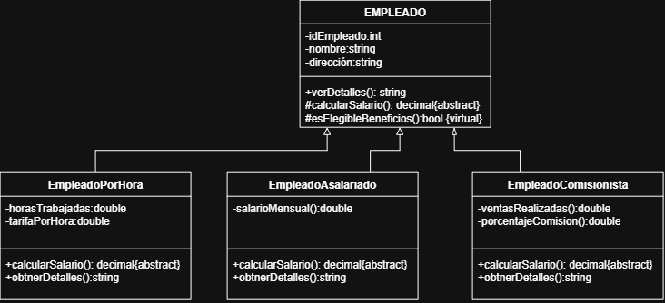
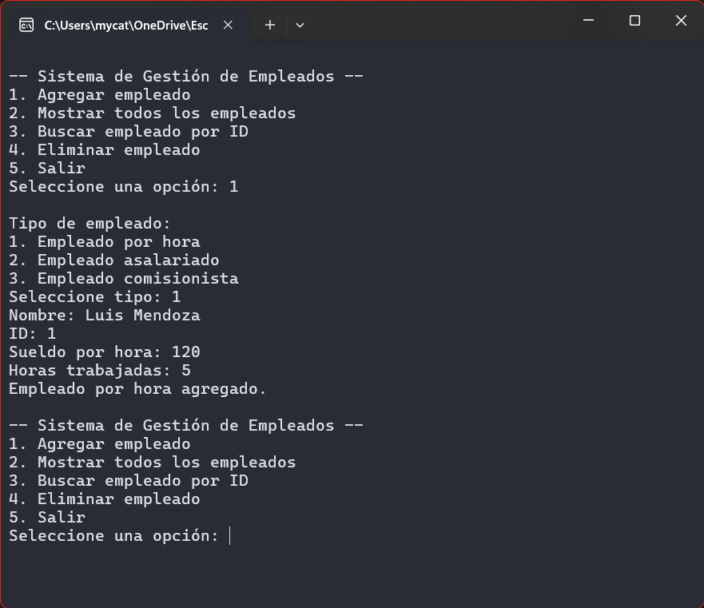
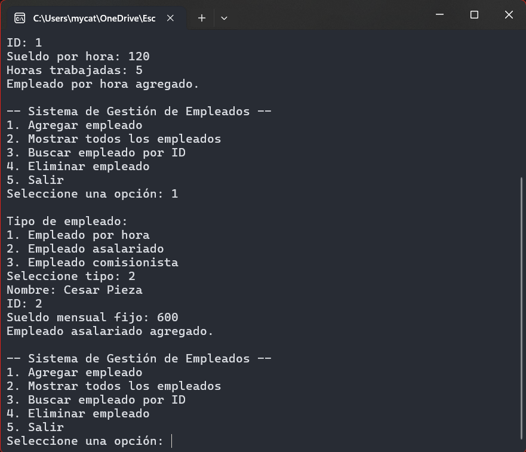
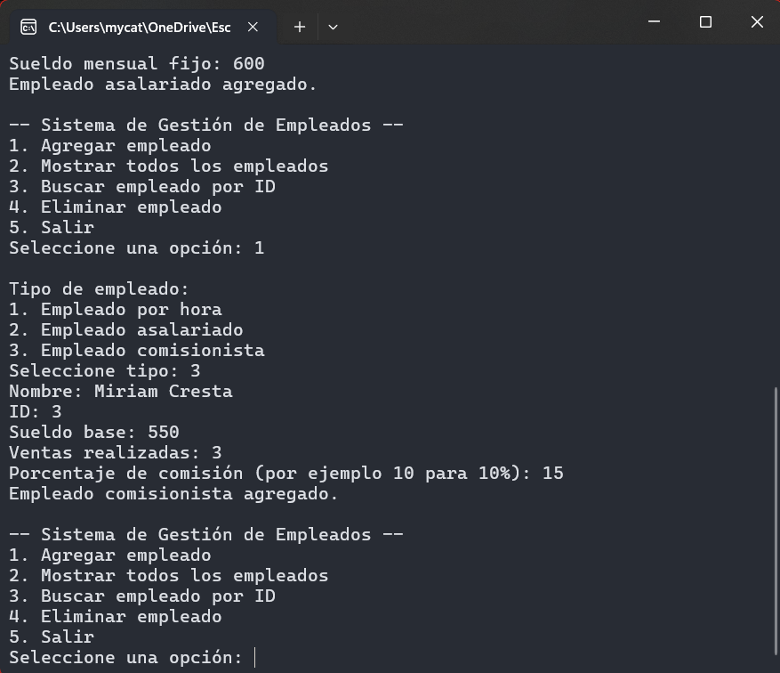
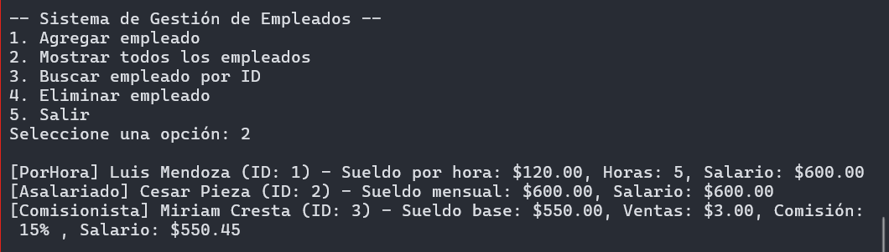
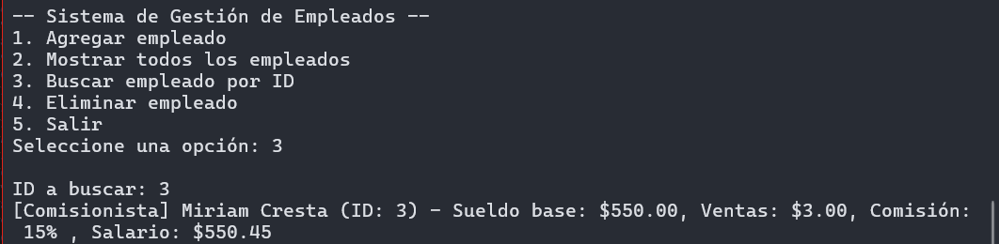

# Sistema de Gestión de Empleados (POO en C#)

Este es un programa de consola desarrollado en **C#** para la materia de **Programación Orientada a Objetos (POO)**. Su objetivo principal es demostrar la aplicación práctica de los pilares de la POO: **Herencia**, **Polimorfismo**, **Encapsulamiento**, **Clases Abstractas** y el **Manejo de Excepciones Personalizadas**.

---

## 👥 Integrantes

<ul>
  <li><b>Escoto Flórez, Christian Emmanuel</b> - EF261246</li>
  <li><b>Hernández Guillén, Fátima Saraí</b> - HG260539</li>
  <li><b>López Marroquín, Ana Elizabeth</b> - LM260681</li>
  <li><b>Noyola Moz, Michael Douglas</b> - NM231585</li>
  <li><b>Rivas Miranda, Elias Ismael</b> - RM250655</li>
</ul>

---

## 🏛️ Jerarquía de Clases y Arquitectura POO

El sistema está diseñado siguiendo una arquitectura limpia orientada a objetos en el espacio de nombres `Taller_Teorico`:



### 1. Clase Base Abstracta (`Empleado`)

- **Encapsulamiento:** Define las propiedades comunes `Nombre` e `ID` con modificadores de acceso que protegen la integridad de los datos (`private set` en el ID).
- **Abstracción:** Al definirse como `public abstract class Empleado`, no puede instanciarse directamente. Sirve como un contrato universal para cualquier tipo de empleado.
- **Método Abstracto:** Contiene el método `public abstract decimal CalcularSalario();`. Al ser abstracto, obliga a cada clase hija a implementar su propia fórmula matemática para el salario.

### 2. Clases Derivadas (Herencia y Polimorfismo)

Cada subclase hereda los tributos e identificadores de `Empleado` (utilizando `: base(nombre, id)` en su constructor) y sobrescribe (`override`) el método `CalcularSalario()` y `ToString()`:

- **`EmpleadoPorHora`**: Representa empleados pagados según el tiempo trabajado.
  $$\text{Salario} = \text{SueldoPorHora} \times \text{HorasTrabajadas}$$
- **`EmpleadoAsalariado`**: Representa empleados con un sueldo mensual fijo.
  $$\text{Salario} = \text{SueldoMensual}$$
- **`EmpleadoComisionista`**: Representa empleados con un sueldo base más un porcentaje de comisión sobre sus ventas.
  $$\text{Salario} = \text{SueldoBase} + \left(\text{VentasRealizadas} \times \frac{\text{PorcentajeComision}}{100}\right)$$

### 3. Excepciones Personalizadas (`EmpleadoNoEncontradoException`)

Demuestra el uso de herencia en el sistema de errores de .NET al heredar de `System.Exception`. Permite capturar situaciones de negocio específicas (por ejemplo, al buscar o eliminar un ID inexistente) de manera limpia y tipada.

### 4. Polimorfismo en Tiempo de Ejecución (`Program.cs`)

El programa administra a todos los trabajadores dentro de una colección unificada: `List<Empleado> empleados`. Al iterar sobre esta lista, C# resuelve dinámicamente qué método `CalcularSalario()` o `ToString()` ejecutar según el tipo real del objeto instanciado en memoria.

---

## ⚙️ Funcionamiento y Características

El programa ofrece un menú interactivo en consola con las siguientes funciones:

1. **Agregar Empleado:** Permite registrar empleados de los 3 tipos con validaciones robustas (evita IDs duplicados o vacíos y valida entradas numéricas positivas).
2. **Mostrar Todos los Empleados:** Imprime el listado completo mostrando el tipo, datos específicos y el salario calculado dinámicamente con formato de moneda (`C2`).
3. **Buscar Empleado por ID:** Realiza una búsqueda insensible a mayúsculas/minúsculas. Si no existe, lanza y captura la excepción personalizada `EmpleadoNoEncontradoException`.
4. **Eliminar Empleado:** Remueve un empleado del registro previa validación de su existencia.

---

## 🚀 Descarga y Ejecución del Programa

### Requisitos Previos

- **.NET SDK** (.NET 6.0, 7.0, 8.0 o superior) o **Visual Studio 2022**. Puedes descargarlo desde el [sitio oficial de .NET](https://dotnet.microsoft.com/download).

### Opción A: Desde Visual Studio (Recomendado)

1. **Clonar el repositorio:**
   ```bash
   git clone <URL-DE-ESTE-REPOSITORIO>
   ```
   _(O alternativamente, descarga el archivo ZIP desde GitHub y descomplímelo)._
2. Abre el archivo **`Taller Teorico.slnx`** o **`Taller Teorico/Taller Teorico.csproj`** en Visual Studio 2022.
3. Presiona **`F5`** o haz clic en el botón verde **Iniciar (Start)** para compilar y lanzar la consola en modo depuración.

### Opción B: Desde la Terminal / CLI de .NET

1. Abre tu terminal (PowerShell, CMD, Git Bash o Terminal de macOS/Linux) y ubícate en la carpeta raíz del proyecto.
2. Entra al directorio del código fuente:
   ```bash
   cd "Taller Teorico"
   ```
3. Compila el proyecto:
   ```bash
   dotnet build
   ```
4. Ejecuta la aplicación:
   ```bash
   dotnet run
   ```

---

## 📸 Evidencia - Capturas de Pantalla

A continuación se observan capturas del funcionamiento del programa en consola:

### Registro de Empleados

|           Empleado por Hora            |          Empleado Asalariado           |         Empleado Comisionista          |
| :------------------------------------: | :------------------------------------: | :------------------------------------: |
|  |  |  |

### Listado General y Salarios



### Búsqueda y Validación por ID


